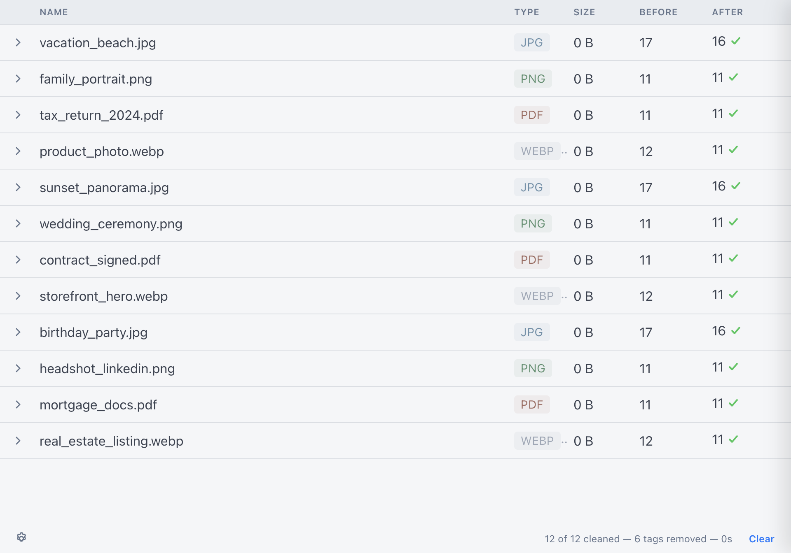

#  ExifCleaner

 

> Desktop app to clean metadata from images, videos, PDFs, and other files.



## Features

- Fast batch processing via ExifTool's stay-open protocol
- Drag and drop files or folders
- Free and open source (MIT)
- Cross-platform: macOS, Windows, and Linux
- Supports 90+ image, video, and document formats ([full list below](#supported-file-types))
- Privacy controls: preserve orientation, save as copy, remove macOS extended attributes, preserve timestamps
- Folder recursion — drop a folder to process all files inside
- Metadata inspection — expand any file to see before/after diff
- Dark mode (follows OS preference)
- 25 languages with in-app language switching
- No automatic updates or network traffic — zero telemetry, zero phone-home
- Signed and notarized on macOS

## What's New in v4.0

ExifCleaner v4.0 is a complete modernization — the first release since v3.6.0 (May 2021). Highlights:

- **5 new privacy features**: preserve orientation, save as copy, xattr removal, preserve timestamps, folder recursion
- **Metadata inspection**: expand any processed file to see exactly what was removed
- **Language switching**: change language from settings without restarting (25 locales)
- **Security hardened**: CSP, Electron Fuses, IPC validation, navigation hardening, permission gates
- **macOS universal binary**: native Apple Silicon support
- **265 unit tests + 42 E2E tests**: comprehensive quality gates

See the [CHANGELOG](CHANGELOG.md) for the full list of changes.

## Download and Install

macOS 10.15+, Windows 10+, and Linux are supported (64-bit).

- **macOS**: [Download the .dmg file](https://github.com/szTheory/exifcleaner/releases/latest) (universal binary — Intel + Apple Silicon)
- **Windows**: [Download the .exe installer or portable version](https://github.com/szTheory/exifcleaner/releases/latest)
- **Linux**: [Download the .AppImage, .deb, or .rpm file](https://github.com/szTheory/exifcleaner/releases/latest)

For Linux, the AppImage needs to be [made executable](https://discourse.appimage.org/t/how-to-make-an-appimage-executable/80) after download.

Arch Linux users can install from the AUR:

```bash
paru -S exifcleaner-bin
```

### Verifying checksums

Each release includes a `SHASUMS256.txt` file. Download it from the [release page](https://github.com/szTheory/exifcleaner/releases/latest) and verify your download:

```bash
sha256sum -c SHASUMS256.txt 2>&1 | grep OK
```

## Links

- [Official Website](https://exifcleaner.com)
- [Download](https://github.com/szTheory/exifcleaner/releases)
- [Source Code](https://github.com/szTheory/exifcleaner)
- [Issue Tracker](https://github.com/szTheory/exifcleaner/issues)
- [Translations file](https://github.com/szTheory/exifcleaner/blob/master/.resources/strings.json)

## Supported File Types

Below is a full list of supported file types that ExifCleaner will remove metadata for. It's based on which file types [ExifTool](https://exiftool.org/) supports write operations for.

- **3G2, 3GP2** – 3rd Gen. Partnership Project 2 a/v (QuickTime-based)
- **3GP, 3GPP** – 3rd Gen. Partnership Project a/v (QuickTime-based)
- **AAX** – Audible Enhanced Audiobook (QuickTime-based)
- **AI, AIT** – Adobe Illustrator [Template] (PS or PDF)
- **ARQ** – Sony Alpha Pixel-Shift RAW (TIFF-based)
- **ARW** – Sony Alpha RAW (TIFF-based)
- **AVIF** – AV1 Image File Format (QuickTime-based)
- **CR2** – Canon RAW 2 (TIFF-based) (CR2 spec)
- **CR3** – Canon RAW 3 (QuickTime-based) (CR3 spec)
- **CRM** – Canon RAW Movie (QuickTime-based)
- **CRW, CIFF** – Canon RAW Camera Image File Format (CRW spec)
- **CS1** – Sinar CaptureShop 1-shot RAW (PSD-based)
- **DCP DNG** – Camera Profile (DNG-like)
- **DNG** – Digital Negative (TIFF-based)
- **DR4** – Canon DPP version 4 Recipe
- **DVB** – Digital Video Broadcasting (QuickTime-based)
- **EPS, EPSF, PS** – [Encapsulated] PostScript Format
- **ERF** – Epson RAW Format (TIFF-based)
- **EXIF** – Exchangeable Image File Format metadata (TIFF-based)
- **EXV** – Exiv2 metadata file (JPEG-based)
- **F4A, F4B, F4P, F4V** – Adobe Flash Player 9+ Audio/Video (QuickTime-based)
- **FFF** – Hasselblad Flexible File Format (TIFF-based)
- **FLIF** – Free Lossless Image Format
- **GIF** – Compuserve Graphics Interchange Format
- **GPR** – GoPro RAW (DNG-based)
- **HDP, WDP, JXR** – Windows HD Photo / Media Photo / JPEG XR (TIFF-based)
- **HEIC, HEIF** – High Efficiency Image Format (QuickTime-based)
- **ICC, ICM** – International Color Consortium color profile
- **IIQ** – Phase One Intelligent Image Quality RAW (TIFF-based)
- **IND, INDD, INDT** – Adobe InDesign Document/Template
- **INSP** – Insta360 Picture (JPEG-based)
- **JP2, JPF, JPM, JPX** – JPEG 2000 image [Compound/Extended]
- **JPEG, JPG, JPE** – Joint Photographic Experts Group image
- **LRV** – Low-Resolution Video (QuickTime-based)
- **M4A, M4B, M4P, M4V** – MPEG-4 Audio/Video (QuickTime-based)
- **MEF** – Mamiya (RAW) Electronic Format (TIFF-based)
- **MIE** – Meta Information Encapsulation (MIE specification)
- **MOS** – Creo Leaf Mosaic (TIFF-based)
- **MOV, QT** – Apple QuickTime Movie
- **MP4** – Motion Picture Experts Group version 4 (QuickTime-based)
- **MPO** – Extended Multi-Picture format (JPEG with MPF extensions)
- **MQV** – Sony Mobile QuickTime Video
- **NEF** – Nikon (RAW) Electronic Format (TIFF-based)
- **NRW** – Nikon RAW (2) (TIFF-based)
- **ORF** – Olympus RAW Format (TIFF-based)
- **PDF** – Adobe Portable Document Format
- **PEF** – Pentax (RAW) Electronic Format (TIFF-based)
- **PNG, JNG, MNG** – Portable/JPEG/Multiple-image Network Graphics
- **PPM, PBM, PGM** – Portable Pixel/Bit/Gray Map
- **PSD, PSB, PSDT** – PhotoShop Document / Large Document / Template
- **QTIF, QTI, QIF** – QuickTime Image File
- **RAF** – FujiFilm RAW Format
- **RAW** – Panasonic RAW (TIFF-based)
- **RW2** – Panasonic RAW 2 (TIFF-based)
- **RWL** – Leica RAW (TIFF-based)
- **SR2** – Sony RAW 2 (TIFF-based)
- **SRW** – Samsung RAW format (TIFF-based)
- **THM** – Thumbnail image (JPEG)
- **TIFF, TIF** – Tagged Image File Format
- **VRD** – Canon DPP Recipe Data
- **WEBP** – WebP image format
- **X3F** – Sigma/Foveon RAW
- **XMP** – Extensible Metadata Platform sidecar file

## File writer limitations

ExifCleaner has the same writer limitations as the underlying `exiftool` it depends on. Taken from the [official website](https://exiftool.org/#limitations):

- ExifTool will not rewrite a file if it detects a significant problem with the file format.
- ExifTool has been tested with a wide range of different images, but since it is not possible to test it with every known image type, there is the possibility that it will corrupt some files. Be sure to keep backups of your files.
- Even though ExifTool does some validation of the information written, it is still possible to write illegal values which may cause problems when reading the images with other software. So take care to validate the information you are writing.
- ExifTool is not guaranteed to remove metadata completely from a file when attempting to delete all metadata. For JPEG images, all APP segments (except Adobe APP14, which is not removed by default) and trailers are removed which effectively removes all metadata, but for other formats the results are less complete:
  - JPEG - APP segments (except Adobe APP14) and trailers are removed.
  - TIFF - XMP, IPTC, ICC_Profile and the ExifIFD are removed, but some EXIF may remain in IFD0. (The CommonIFD0 Shortcut tag is provided to simplify removal of common metadata tags from IFD0.)
  - PNG - Only XMP, EXIF, ICC_Profile and native PNG textual data chunks are removed.
  - PDF - The original metadata is never actually removed.
  - PS - Only XMP and some native PostScript tags may be deleted.
  - MOV/MP4 - Most top-level metadata is removed.
  - RAW formats - It is not recommended to remove all metadata from RAW images because this will likely remove some proprietary information that is necessary for proper rendering of the image.

## Translations

New translations and corrections to existing translations are welcome! See the [Adding a Translation](#adding-a-translation) section below. Current translation status:

- Arabic by [@ZER0-X](https://github.com/ZER0-X)
- Catalan by [@marcarmengou](https://github.com/marcarmengou)
- Chinese (Mandarin) by [MarcusPierce](https://github.com/MarcusPierce)
- Croatian by [@milotype](https://github.com/milotype)
- Czech by [@t0mzSK](https://github.com/t0mzSK)
- Danish by [@zlatco](https://github.com/zlatco)
- Dutch by [@rvl-code](https://github.com/rvl-code)
- French by [@NathanBnm](https://github.com/NathanBnm)
- German by [@tayfuuun](https://github.com/tayfuuun), [@philippsandhaus](https://github.com/philippsandhaus)
- Hungarian by [@icetee](https://github.com/icetee)
- Italian by [@PolpOnline](https://github.com/PolpOnline)
- Japanese by @AKKED
- Malayalam by [@theunknownKiran](https://github.com/theunknownKiran)
- Persian by [@RamtinA](https://github.com/RamtinA)
- Polish by [@m1chu](https://github.com/m1chu)
- Portuguese (Brazil) by [@iraamaro](https://github.com/iraamaro), @dadodollabela
- Russian by [@likhner](https://github.com/likhner)
- Slovak by [@LiJu09](https://github.com/LiJu09)
- Spanish by [@ff-ss](https://github.com/ff-ss)
- Swedish by [@sastofficial](https://github.com/sastofficial)
- Turkish by [@bsonmez](https://github.com/bsonmez)
- Ukrainian by [@hugonote](https://github.com/hugonote)
- Vietnamese by [@tensingnightco](https://github.com/tensingnightco)

## Development

Built with [Electron 35](https://electronjs.org), [React 19](https://react.dev), and [TypeScript 5.7](https://www.typescriptlang.org/) (strict mode). Uses a hand-rolled [ExifTool](https://exiftool.org/) wrapper implementing the `-stay_open` protocol for fast batch processing.

### Run the app in dev mode

```bash
git clone https://github.com/szTheory/exifcleaner.git
cd exifcleaner
yarn install
```

Pull down the latest ExifTool binaries (requires Perl, macOS/Linux only):

```bash
yarn run update-exiftool
```

Launch the app with Hot Module Reload:

```bash
yarn dev
```

### Running tests

```bash
yarn test          # Unit tests (Vitest, ~1.4s)
yarn test:e2e      # E2E tests (Playwright, ~30s) — requires yarn compile first
yarn lint          # Prettier formatting check
yarn typecheck     # TypeScript strict mode check
```

### Adding a Translation

All translations live in [`.resources/strings.json`](https://github.com/szTheory/exifcleaner/blob/master/.resources/strings.json). Add an entry for the new language code ([list of codes](https://www.electronjs.org/docs/api/locales)) under each string:

```json
"empty.title": {
  "en": "No files selected",
  "fr": "Aucun fichier selectionne",
  "es": "Your translation here"
},
```

To test with a specific locale:

```bash
yarn dev --lang=es
```

### Publishing a new release

Releases are built by GitHub Actions. To publish:

1. Trigger the [Release workflow](../../actions/workflows/release.yml) via `workflow_dispatch` in the GitHub Actions UI
2. CI builds all platforms (macOS signed + notarized, Windows, Linux)
3. A draft GitHub release is created with all artifacts and SHASUMS256.txt
4. Review the draft and publish when ready

### Contributors

Thanks to all the people who submitted bug reports, fixes, and translations. If I've missed you, let me know and I'll add you.

- [@m1chu](https://github.com/m1chu) - Polish translation, Mac dock bug fix, Unicode filename debugging
- [@LukasThyWalls](https://github.com/LukasThyWalls) - Unicode filename debugging, feature suggestions
- @AKKED - Japanese translation, Unicode filename debugging
- [@TomasGutierrez0](https://github.com/TomasGutierrez0) - ExifTool dependency audit
- [@5a384507-18ce-417c-bb55-d4dfcc8883fe](https://github.com/5a384507-18ce-417c-bb55-d4dfcc8883fe) - Linux version debugging
- [@totoroot](https://github.com/totoroot) - Linux AppImage debugging, usability feedback, feature suggestions
- [@Scopuli](https://github.com/Scopuli) - Linux AppImage debugging
- [@Tox86](https://github.com/Tox86) - Settings menu bug report
- [@ff-ss](https://github.com/ff-ss) - Spanish translation
- [@tayfuuun](https://github.com/tayfuuun) - German translation
- [@philippsandhaus](https://github.com/philippsandhaus) - German translation fixes
- [@airvue](https://github.com/airvue) - Ubuntu .deb debugging
- [@Goblin80](https://github.com/Goblin80) - Ubuntu .deb debugging
- [@zahroc](https://github.com/zahroc) - Bulk directory error diagnosis
- [@iraamaro](https://github.com/iraamaro) - Portuguese (Brazil) translation, Debian/Slackware build fix
- [@LiJu09](https://github.com/LiJu09) - Slovak translation
- [@likhner](https://github.com/likhner) - Russian translation
- [@hugonote](https://github.com/hugonote) - Ukrainian translation
- @dadodollabela - Portuguese (Brazil) translation fixes
- [@zlatco](https://github.com/zlatco) - Danish translation
- [@ZER0-X](https://github.com/ZER0-X) - Arabic translation
- [@rvl-code](https://github.com/rvl-code) - Dutch translation
- [@PolpOnline](https://github.com/PolpOnline) - Italian translation, Arch Linux distribution
- [@NathanBnm](https://github.com/NathanBnm) - French translation
- [@Dyrimon](https://github.com/Dyrimon) - Linux AppImage exit fix
- [@MarcusPierce](https://github.com/MarcusPierce) - Chinese (Mandarin) translation
- [@brandonlou](https://github.com/brandonlou) - CVE-2021-22204 notification
- [@v4k0nd](https://github.com/v4k0nd) - Checksum verification instructions
- [@papb](https://github.com/papb) - Windows portable build
- [@Bellisario](https://github.com/Bellisario) - Windows portable build
- [@overjt](https://github.com/overjt) - XSS and Electron reverse shell vulnerability PoC
- [@bsonmez](https://github.com/bsonmez) - Turkish translation
- [@milotype](https://github.com/milotype) - Croatian translation
- [@icetee](https://github.com/icetee) - Hungarian translation
- [@sastofficial](https://github.com/sastofficial) - Swedish translation
- [@theunknownKiran](https://github.com/theunknownKiran) - Malayalam translation
- [@t0mzSK](https://github.com/t0mzSK) - Czech translation
- [@tensingnightco](https://github.com/tensingnightco) - Vietnamese translation
- [@marcarmengou](https://github.com/marcarmengou) - Catalan translation
- [@RamtinA](https://github.com/RamtinA) - Persian translation
