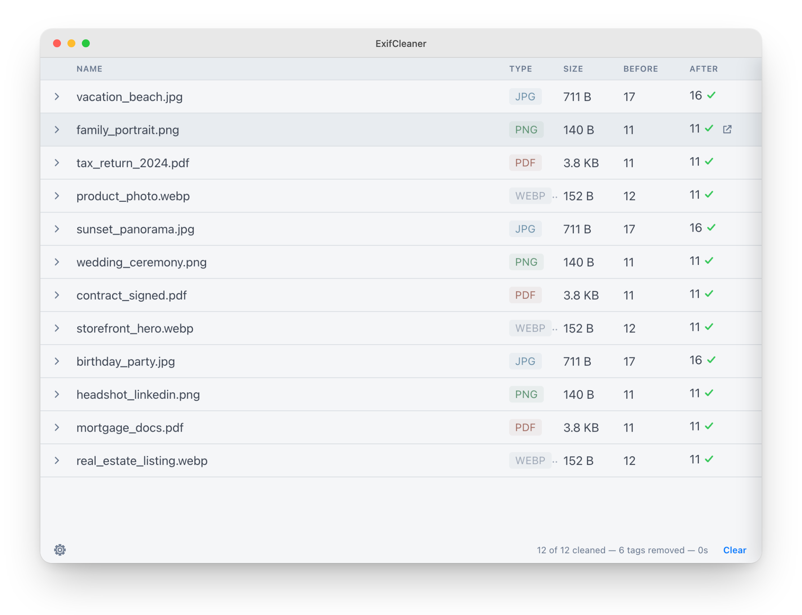

#  ExifCleaner

 

> Desktop app to clean metadata from images, videos, PDFs, and other files.

<picture>
  <source media="(prefers-color-scheme: dark)" srcset="static/screenshot-dark.png">
  
</picture>

## Features

- Fast batch processing via ExifTool's stay-open protocol
- Drag and drop files or folders
- Free and open source (MIT)
- Cross-platform: macOS, Windows, and Linux
- Supports 90+ image, video, and document formats ([full list below](#supported-file-types))
- Privacy controls: preserve orientation, save as copy, remove macOS extended attributes, preserve timestamps
- Folder recursion — drop a folder to process all files inside
- Metadata inspection — expand any file to see before/after diff
- Dark mode (follows OS preference)
- 25 languages with in-app language switching
- No automatic updates or network traffic — zero telemetry, zero phone-home
- Every release verified by CI against the actual installed app on macOS, Windows, and Linux

## What's New in v4.0

ExifCleaner v4.0 is a complete modernization — the first release since v3.6.0 (May 2021). Highlights:

- **5 new privacy features**: preserve orientation, save as copy, xattr removal, preserve timestamps, folder recursion
- **Metadata inspection**: expand any processed file to see exactly what was removed
- **Language switching**: change language from settings without restarting (25 locales)
- **Security hardened**: CSP, Electron Fuses, IPC validation, navigation hardening, permission gates
- **Native Apple Silicon and Intel builds**: separate downloads, no Rosetta needed
- **265 unit tests + 42 E2E tests**: comprehensive quality gates

See the [CHANGELOG](CHANGELOG.md) for the full list of changes.

## Download and Install

macOS 12+, Windows 10+, and Linux are supported (64-bit).

- **macOS**: [Download the .dmg file](https://github.com/szTheory/exifcleaner/releases/latest) — pick the `arm64` build for Apple Silicon, the other for Intel
- **Windows**: [Download the portable `.exe` (recommended) or installer](https://github.com/szTheory/exifcleaner/releases/latest)
- **Linux**: [Download the .AppImage, .deb, or .rpm file](https://github.com/szTheory/exifcleaner/releases/latest)

For Linux, the AppImage needs to be [made executable](https://discourse.appimage.org/t/how-to-make-an-appimage-executable/80) after download.

> **Your OS will warn you the first time you open it.** ExifCleaner is not code-signed —
> see [Opening unsigned builds](#opening-unsigned-builds) for the one-time steps, and why.

Arch Linux users can install from the AUR:

```bash
paru -S exifcleaner-bin
```

### Opening unsigned builds

ExifCleaner is **not code-signed**. On first launch your OS will warn you. This is
expected, it is a one-time step, and it does not mean the download is unsafe — verify
the checksum below if you want certainty.

**macOS**

- **macOS 14 (Sonoma) and earlier**: right-click (or Control-click) the app → **Open** →
  click **Open** in the dialog.
- **macOS 15 (Sequoia) and later**: right-click → Open no longer works. Double-click the
  app once and let it be blocked, then go to **System Settings → Privacy & Security**,
  scroll down, and click **Open Anyway** next to the ExifCleaner message.

**Windows**

Windows Defender SmartScreen shows _"Windows protected your PC"_. Click **More info** →
**Run anyway**.

**Linux**

No gatekeeping. The AppImage just needs `chmod +x` (above). `.deb` and `.rpm` install
normally.

### Why isn't it signed?

Signing macOS builds requires an Apple Developer certificate at $99/year, and the
certificate embeds the holder's **legal name**, which macOS then displays in the
Gatekeeper dialog. Windows requires a separate EV certificate at $200–600/year tied to a
verified legal identity. For a privacy tool maintained anonymously, that tradeoff isn't
one this project is willing to make.

What you get instead:

- **Published SHA-256 checksums** for every artifact (below) — verifies the download is
  byte-for-byte what CI built.
- **Every release is built in public** by [GitHub Actions](.github/workflows/release.yml)
  from tagged source you can read, not on anyone's laptop.
- **CI installs and runs the actual artifact** before it can be released — it mounts the
  DMG, installs it, launches it, and strips metadata from a test image. A build that
  doesn't work never reaches the release page.

> **Only download from the [GitHub releases page](https://github.com/szTheory/exifcleaner/releases).**
> Builds shared through other channels are not ours and are not verified.

### Verifying checksums

Each release includes a `SHASUMS256.txt` file. Download it from the [release page](https://github.com/szTheory/exifcleaner/releases/latest) and verify your download:

```bash
sha256sum -c SHASUMS256.txt 2>&1 | grep OK
```

## Links

- [Official Website](https://exifcleaner.com)
- [Download](https://github.com/szTheory/exifcleaner/releases)
- [Source Code](https://github.com/szTheory/exifcleaner)
- [Issue Tracker](https://github.com/szTheory/exifcleaner/issues)
- [Engineering guide](docs/README.md)
- [Contributing and translations](CONTRIBUTING.md)

## Supported File Types

Below is the intake list derived from formats for which [ExifTool](https://exiftool.org/) exposes write operations. Acceptance does not guarantee complete, irreversible removal for every container; the important exceptions are documented immediately after the list.

- **3G2, 3GP2** – 3rd Gen. Partnership Project 2 a/v (QuickTime-based)
- **3GP, 3GPP** – 3rd Gen. Partnership Project a/v (QuickTime-based)
- **AAX** – Audible Enhanced Audiobook (QuickTime-based)
- **AI, AIT** – Adobe Illustrator [Template] (PS or PDF)
- **ARQ** – Sony Alpha Pixel-Shift RAW (TIFF-based)
- **ARW** – Sony Alpha RAW (TIFF-based)
- **AVIF** – AV1 Image File Format (QuickTime-based)
- **CR2** – Canon RAW 2 (TIFF-based) (CR2 spec)
- **CR3** – Canon RAW 3 (QuickTime-based) (CR3 spec)
- **CRM** – Canon RAW Movie (QuickTime-based)
- **CRW, CIFF** – Canon RAW Camera Image File Format (CRW spec)
- **CS1** – Sinar CaptureShop 1-shot RAW (PSD-based)
- **DCP DNG** – Camera Profile (DNG-like)
- **DNG** – Digital Negative (TIFF-based)
- **DR4** – Canon DPP version 4 Recipe
- **DVB** – Digital Video Broadcasting (QuickTime-based)
- **EPS, EPSF, PS** – [Encapsulated] PostScript Format
- **ERF** – Epson RAW Format (TIFF-based)
- **EXIF** – Exchangeable Image File Format metadata (TIFF-based)
- **EXV** – Exiv2 metadata file (JPEG-based)
- **F4A, F4B, F4P, F4V** – Adobe Flash Player 9+ Audio/Video (QuickTime-based)
- **FFF** – Hasselblad Flexible File Format (TIFF-based)
- **FLIF** – Free Lossless Image Format
- **GIF** – Compuserve Graphics Interchange Format
- **GPR** – GoPro RAW (DNG-based)
- **HDP, WDP, JXR** – Windows HD Photo / Media Photo / JPEG XR (TIFF-based)
- **HEIC, HEIF** – High Efficiency Image Format (QuickTime-based)
- **ICC, ICM** – International Color Consortium color profile
- **IIQ** – Phase One Intelligent Image Quality RAW (TIFF-based)
- **IND, INDD, INDT** – Adobe InDesign Document/Template
- **INSP** – Insta360 Picture (JPEG-based)
- **JP2, JPF, JPM, JPX** – JPEG 2000 image [Compound/Extended]
- **JPEG, JPG, JPE** – Joint Photographic Experts Group image
- **LRV** – Low-Resolution Video (QuickTime-based)
- **M4A, M4B, M4P, M4V** – MPEG-4 Audio/Video (QuickTime-based)
- **MEF** – Mamiya (RAW) Electronic Format (TIFF-based)
- **MIE** – Meta Information Encapsulation (MIE specification)
- **MOS** – Creo Leaf Mosaic (TIFF-based)
- **MOV, QT** – Apple QuickTime Movie
- **MP4** – Motion Picture Experts Group version 4 (QuickTime-based)
- **MPO** – Extended Multi-Picture format (JPEG with MPF extensions)
- **MQV** – Sony Mobile QuickTime Video
- **NEF** – Nikon (RAW) Electronic Format (TIFF-based)
- **NRW** – Nikon RAW (2) (TIFF-based)
- **ORF** – Olympus RAW Format (TIFF-based)
- **PDF** – Adobe Portable Document Format
- **PEF** – Pentax (RAW) Electronic Format (TIFF-based)
- **PNG, JNG, MNG** – Portable/JPEG/Multiple-image Network Graphics
- **PPM, PBM, PGM** – Portable Pixel/Bit/Gray Map
- **PSD, PSB, PSDT** – PhotoShop Document / Large Document / Template
- **QTIF, QTI, QIF** – QuickTime Image File
- **RAF** – FujiFilm RAW Format (currently refused without writing; see limitations)
- **RAW** – Panasonic RAW (TIFF-based)
- **RW2** – Panasonic RAW 2 (TIFF-based)
- **RWL** – Leica RAW (TIFF-based)
- **SR2** – Sony RAW 2 (TIFF-based)
- **SRW** – Samsung RAW format (TIFF-based)
- **THM** – Thumbnail image (JPEG)
- **TIFF, TIF** – Tagged Image File Format
- **VRD** – Canon DPP Recipe Data
- **WEBP** – WebP image format
- **X3F** – Sigma/Foveon RAW
- **XMP** – Extensible Metadata Platform sidecar file

## Known limitations by format

ExifCleaner relies on ExifTool's writer support. Some formats impose structural limits
that prevent ExifCleaner from making an irreversible-removal guarantee:

| Format | What ExifCleaner can guarantee | Status |
| --- | --- | --- |
| RAF | The operation is refused before writing because ExifCleaner cannot currently guarantee a safe cleaned RAF artifact. | Source is left unchanged |
| PDF | ExifTool writes a reversible PDF update; the original metadata remains recoverable, so ExifCleaner cannot securely erase PDF metadata. | Documented limitation — [#216](https://github.com/szTheory/exifcleaner/issues/216) |
| MKV / Matroska | ExifTool exposes Matroska metadata for reading but does not provide writable tags, so ExifCleaner cannot reliably remove it without a separate remuxing engine. | Documented limitation — [#182](https://github.com/szTheory/exifcleaner/issues/182) |
| TIFF | Removal may be partial because some metadata can remain in IFD0. | Open investigation — [#199](https://github.com/szTheory/exifcleaner/issues/199) |
| AVIF | A user-reported partial-removal case remains under investigation. | Open investigation — [#215](https://github.com/szTheory/exifcleaner/issues/215) |

The PDF behavior is documented in the
[ExifTool application documentation](https://exiftool.org/exiftool_pod2.html), and
ExifTool's [Matroska tag table](https://exiftool.org/TagNames/Matroska.html) marks the
container's extracted tags as non-writable. TIFF and AVIF remain open because their
reported behavior may still be addressable without introducing a separate file-format
engine.

## File writer limitations

ExifCleaner has the same writer limitations as the underlying `exiftool` it depends on. Taken from the [official website](https://exiftool.org/#limitations):

- ExifTool will not rewrite a file if it detects a significant problem with the file format.
- ExifTool has been tested with a wide range of different images, but since it is not possible to test it with every known image type, there is the possibility that it will corrupt some files. Be sure to keep backups of your files.
- Even though ExifTool does some validation of the information written, it is still possible to write illegal values which may cause problems when reading the images with other software. So take care to validate the information you are writing.
- ExifTool is not guaranteed to remove metadata completely from a file when attempting to delete all metadata. For JPEG images, all APP segments (except Adobe APP14, which is not removed by default) and trailers are removed which effectively removes all metadata, but for other formats the results are less complete:
  - JPEG - APP segments (except Adobe APP14) and trailers are removed.
  - TIFF - XMP, IPTC, ICC_Profile and the ExifIFD are removed, but some EXIF may remain in IFD0. (The CommonIFD0 Shortcut tag is provided to simplify removal of common metadata tags from IFD0.)
  - PNG - Only XMP, EXIF, ICC_Profile and native PNG textual data chunks are removed.
  - PDF - The original metadata is never actually removed.
  - PS - Only XMP and some native PostScript tags may be deleted.
  - MOV/MP4 - Most top-level metadata is removed.
  - RAW formats - It is not recommended to remove all metadata from RAW images because this will likely remove some proprietary information that is necessary for proper rendering of the image.

## Translations

New translations and corrections are welcome. See [Contributing](CONTRIBUTING.md#translation-corrections) for the small-string workflow. Current translation status:

- Arabic by [@zefr0x](https://github.com/zefr0x)
- Catalan by [@marcarmengou](https://github.com/marcarmengou)
- Chinese (Mandarin) by [MarcusPierce](https://github.com/MarcusPierce)
- Croatian by [@milotype](https://github.com/milotype)
- Czech by [@tomz00](https://github.com/tomz00)
- Danish by [@zlatco](https://github.com/zlatco)
- Dutch by [@rvl-code](https://github.com/rvl-code)
- French by [@NathanBnm](https://github.com/NathanBnm)
- German by [@tayfuuun](https://github.com/tayfuuun), [@philippsandhaus](https://github.com/philippsandhaus)
- Hungarian by [@icetee](https://github.com/icetee)
- Italian by [@PolpOnline](https://github.com/PolpOnline)
- Japanese by @AKKED
- Malayalam by [@theunknownKiran](https://github.com/theunknownKiran)
- Persian by [@RamtinA](https://github.com/RamtinA)
- Polish by [@m1chu](https://github.com/m1chu)
- Portuguese (Brazil) by [@iraamaro](https://github.com/iraamaro), @dadodollabela
- Russian by [@likhner](https://github.com/likhner)
- Slovak by [@LiJu09](https://github.com/LiJu09)
- Spanish by [@ff-ss](https://github.com/ff-ss)
- Swedish by [@sastofficial](https://github.com/sastofficial)
- Turkish by [@bsonmez](https://github.com/bsonmez)
- Ukrainian by [@hugonote](https://github.com/hugonote)
- Vietnamese by [@tensingnightco](https://github.com/tensingnightco)

## Development

Built with [Electron](https://electronjs.org), [React 19](https://react.dev), and [TypeScript](https://www.typescriptlang.org/) in strict mode. A hand-rolled [ExifTool](https://exiftool.org/) adapter uses the `-stay_open` protocol for fast batch processing. The [engineering guide](docs/README.md) explains the architecture and traces a file end to end.

### Run the app in dev mode

```bash
git clone https://github.com/szTheory/exifcleaner.git
cd exifcleaner
yarn install
```

Pull down the latest ExifTool binaries (requires Perl, macOS/Linux only):

```bash
yarn run update-exiftool
```

Launch the app with Hot Module Reload:

```bash
yarn dev
```

### Running tests

```bash
yarn test          # Unit tests (Vitest, ~1.4s)
yarn test:e2e      # E2E tests (Playwright, ~30s) — requires yarn compile first
yarn lint          # Prettier formatting check
yarn typecheck     # TypeScript strict mode check
```

### Adding or correcting a translation

Edit `.resources/locales/<locale>.json`, then run `yarn i18n:write` and
`yarn i18n:check`. See [CONTRIBUTING.md](CONTRIBUTING.md#translation-corrections) for
placeholder, review, and testing guidance.

### Publishing a new release

Releases are built by GitHub Actions. To publish:

1. Run `yarn verify:release`. If it reports known-gap release blockers, fix or remove the blocking marker before publishing; if it reports release-note drift, run `yarn known-gaps:write` and review the managed block.
2. Make sure `RELEASE_NOTES.md` is current — it becomes the release body verbatim
3. Trigger the [Release workflow](../../actions/workflows/release.yml) via `workflow_dispatch` in the GitHub Actions UI
4. CI builds all platforms unsigned, then **installs and smoke-tests one representative
   artifact per platform** — mounts the Apple Silicon DMG / runs the NSIS installer / extracts the AppImage,
   launches the installed binary, and strips metadata from a test image. macOS
   additionally runs the Gatekeeper regression gate. The remaining four binaries receive
   exact-inventory, non-empty, and format-structure checks. A build that fails any of these
   cannot reach the release page.
5. A draft GitHub release is created with all artifacts and SHASUMS256.txt
6. Download the DMG **through a browser** and confirm it opens (this is the one check CI
   cannot do — neither `codesign` nor `spctl` can tell "shows a dialog you click through"
   from "launches cleanly")
7. Review the draft and publish when ready

### Contributors

Thanks to all the people who submitted bug reports, fixes, and translations. If I've missed you, let me know and I'll add you.

- [@m1chu](https://github.com/m1chu) - Polish translation, Mac dock bug fix, Unicode filename debugging
- [@LukasThyWalls](https://github.com/LukasThyWalls) - Unicode filename debugging, feature suggestions
- @AKKED - Japanese translation, Unicode filename debugging
- [@TomasGutierrez0](https://github.com/TomasGutierrez0) - ExifTool dependency audit
- [@5a384507-18ce-417c-bb55-d4dfcc8883fe](https://github.com/5a384507-18ce-417c-bb55-d4dfcc8883fe) - Linux version debugging
- [@totoroot](https://github.com/totoroot) - Linux AppImage debugging, usability feedback, feature suggestions
- [@Scopuli](https://github.com/Scopuli) - Linux AppImage debugging
- [@Tox86](https://github.com/Tox86) - Settings menu bug report
- [@ff-ss](https://github.com/ff-ss) - Spanish translation
- [@tayfuuun](https://github.com/tayfuuun) - German translation
- [@philippsandhaus](https://github.com/philippsandhaus) - German translation fixes
- [@airvue](https://github.com/airvue) - Ubuntu .deb debugging
- [@Goblin80](https://github.com/Goblin80) - Ubuntu .deb debugging
- [@zahroc](https://github.com/zahroc) - Bulk directory error diagnosis
- [@iraamaro](https://github.com/iraamaro) - Portuguese (Brazil) translation, Debian/Slackware build fix
- [@LiJu09](https://github.com/LiJu09) - Slovak translation
- [@likhner](https://github.com/likhner) - Russian translation
- [@hugonote](https://github.com/hugonote) - Ukrainian translation
- @dadodollabela - Portuguese (Brazil) translation fixes
- [@zlatco](https://github.com/zlatco) - Danish translation
- [@zefr0x](https://github.com/zefr0x) - Arabic translation
- [@rvl-code](https://github.com/rvl-code) - Dutch translation
- [@PolpOnline](https://github.com/PolpOnline) - Italian translation, Arch Linux distribution
- [@NathanBnm](https://github.com/NathanBnm) - French translation
- [@Dyrimon](https://github.com/Dyrimon) - Linux AppImage exit fix
- [@MarcusPierce](https://github.com/MarcusPierce) - Chinese (Mandarin) translation
- [@brandonlou](https://github.com/brandonlou) - CVE-2021-22204 notification
- [@v4k0nd](https://github.com/v4k0nd) - Checksum verification instructions
- [@papb](https://github.com/papb) - Windows portable build
- [@Bellisario](https://github.com/Bellisario) - Windows portable build
- [@overjt](https://github.com/overjt) - XSS and Electron reverse shell vulnerability PoC
- [@bsonmez](https://github.com/bsonmez) - Turkish translation
- [@milotype](https://github.com/milotype) - Croatian translation
- [@icetee](https://github.com/icetee) - Hungarian translation
- [@sastofficial](https://github.com/sastofficial) - Swedish translation
- [@theunknownKiran](https://github.com/theunknownKiran) - Malayalam translation
- [@tomz00](https://github.com/tomz00) - Czech translation
- [@tensingnightco](https://github.com/tensingnightco) - Vietnamese translation
- [@marcarmengou](https://github.com/marcarmengou) - Catalan translation
- [@RamtinA](https://github.com/RamtinA) - Persian translation
