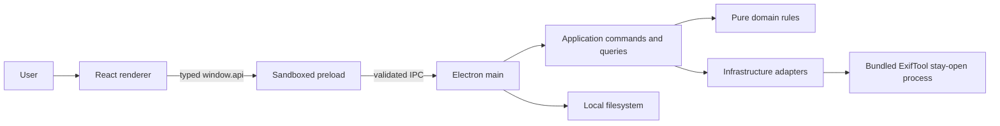
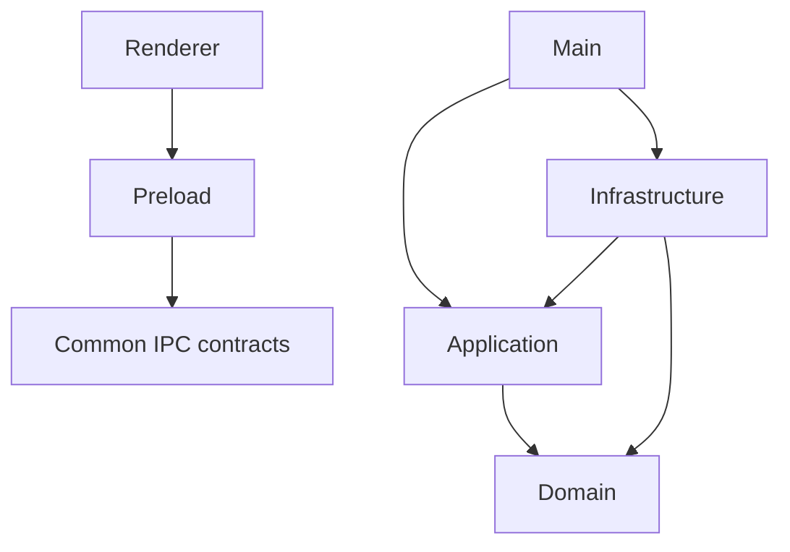

# Architecture

ExifCleaner is a local desktop pipeline around a bundled ExifTool process. Its central
design constraint is stronger than “remove metadata”: **never claim success without a
measured result, and never trade the original file for an unverified output**.

## The system at a glance

The renderer has no Node or Electron imports. The preload exposes a deliberately small
API. Main-process handlers validate both the sender and payload before reaching the
application layer.

## Layers and dependency direction

- `domain/` holds pure rules and types: supported formats, settings migration, metadata
  diffs, and outcome classification.
- `application/` describes work through commands, queries, and ports. It does not know
  Electron.
- `infrastructure/` implements ports for ExifTool, settings storage, logging, and xattrs.
- `main/` is the composition and trust boundary: IPC, lifecycle, output transactions,
  menus, and native dialogs.
- `preload/` is the only renderer-to-Electron bridge.
- `renderer/` owns presentation state and interaction, not filesystem authority.

`createContainer()` is the composition root. If a new capability needs I/O, define the
policy above infrastructure and wire its adapter there rather than importing Node APIs
into domain or renderer code.

## Load-bearing invariants

- All user-selected paths cross a validated main-process boundary. CR/LF is rejected
  before it can become another line in ExifTool’s `-stay_open` protocol.
- Risky output is written to a separate path, reopened by ExifTool, and only then exposed
  or committed.
- A failure is terminal for one file, not for the remaining batch.
- “Cleaned” comes from a before/after key diff. Errors, refusals, and unchanged files do
  not inflate the cleaned count.
- Network access is not part of normal application behavior. There is no telemetry or
  background updater.
- Packaged artifacts—not only the development renderer—are the release oracle.

## State ownership

Settings and filesystem truth live in main-process services. The renderer keeps only the
state needed to explain the current batch. Native progress indicators receive counts via
fire-and-forget IPC, while file operations use request/response channels.

For the concrete path through these layers, continue with the
[code walkthrough](../guides/code-walkthrough.md).

