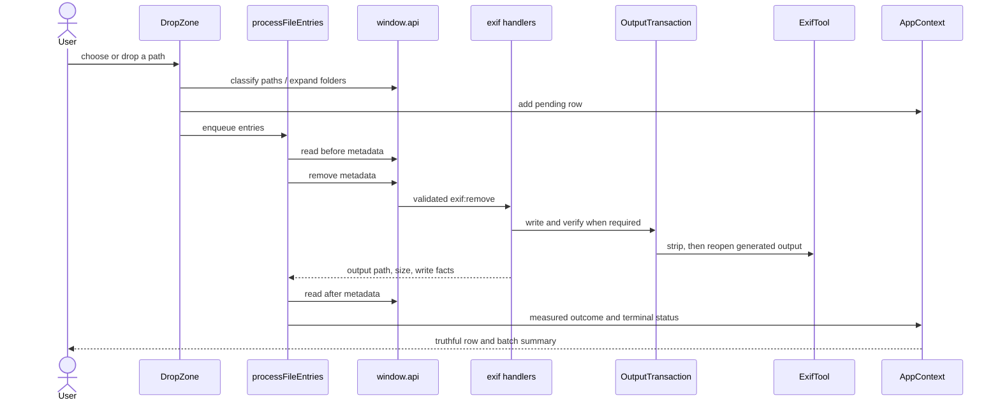

# Code walkthrough: one file through ExifCleaner

Read [Architecture](../architecture/overview.md) first. This walkthrough follows the
happy path, then names the failures worth remembering.

## 1. Intake establishes identity and grouping

`DropZone.processSelectedPaths()` handles drag/drop, native file selection, and folder
selection through one path. Main classifies paths and supplies real sizes; the renderer
filters unsupported formats, creates a stable row ID, and preserves folder grouping.

Folder expansion is read-only. Unsupported or unreadable inputs are reported instead of
silently disappearing.

## 2. The renderer owns sequencing, not filesystem authority

`processFileEntries()` drains a queue sequentially. Sequential work avoids races in the
single stay-open ExifTool process and keeps native progress counts deterministic.

An already-clean file with no requested xattr work stops after the first read. It gets an
`already-clean` outcome and is not rewritten.

## 3. Preload makes IPC boring

The renderer calls `window.api.exif.removeMetadata(path)`. `TypedInvoke` ties every call to
`IpcInvokeMap`, so channel arguments and responses change together. Preload contains no
business policy; it narrows events and exposes the minimum Electron surface.

## 4. Main chooses the safe write strategy

`setupExifHandlers()` reads current settings, selects overwrite/copy/staged behavior, and
routes the work through application commands. RAF is refused until the project has a safe
write oracle. Video and other guarded formats use `OutputTransaction`.

## 5. The transaction publishes only verified output

The transaction writes a generated path, asks ExifTool to reopen it, removes an invalid
candidate, and atomically renames a verified stage when overwrite mode requires it. A
cleanup failure reports its residual path so the UI never implies that nothing was left.

## 6. The result is measured again

The renderer reads metadata from the **returned output path**, not the source path it
remembers. `summarizeMetadataChange()` compares keys, so a new computed field cannot hide
the removal of a sensitive field merely because the totals happen to match.

The reducer stores outcome, before/after metadata, output location, size, and failure
stage. The table then renders from state; it does not infer success from animation or IPC
completion.

## Failures worth knowing

- Invalid protocol characters are rejected before ExifTool receives a command.
- Write, verification, cleanup, commit, and xattr failures have distinct stages.
- One failed file still calls the progress notification and the queue continues.
- A refused RAF and an unchanged MP4 are not “cleaned.”
- Save-as-copy collision selection belongs to main because only main owns filesystem truth.

