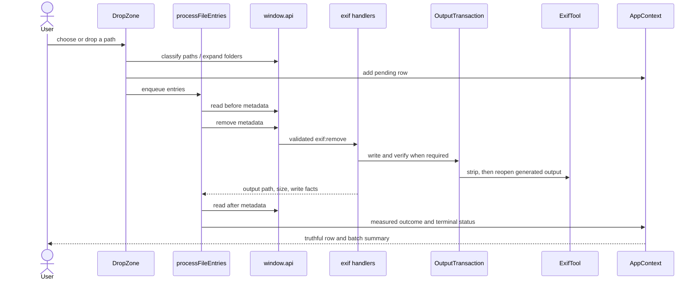

# Code walkthrough: one file through ExifCleaner

Read [Architecture](../architecture/overview.md) first. This walkthrough follows the
happy path, then names the failures worth remembering.

Each section includes source-shaped excerpts; `// ...` marks details elided to keep the
important control flow visible.



## 1. Intake establishes identity and grouping

`DropZone.processSelectedPaths()` handles drag/drop, native file selection, and folder
selection through one path. Main classifies paths and supplies real sizes; the renderer
filters unsupported formats, creates a stable row ID, and preserves folder grouping.

Folder expansion is read-only. Unsupported or unreadable inputs are reported instead of
silently disappearing.

```tsx
// src/renderer/components/ui/DropZone.tsx
const processSelectedPaths = useCallback(async (allPaths: string[]) => {
	const { files: filePaths, folders: folderPaths } =
		await window.api.folder.classify(allPaths);

	const looseEntries = buildLooseEntries(filePaths);
	if (looseEntries.length > 0) {
		dispatch({ type: "ADD_FILES", files: looseEntries });
		processFiles(looseEntries);
	}

	for (const folderPath of folderPaths) {
		await expandAndProcessFolder({ folderPath, dispatch, processFiles /* ... */ });
	}
}, [dispatch, processFiles /* ... */]);
```

```tsx
// src/renderer/components/ui/DropZone.tsx
function buildFileEntry(path: string, name: string, size: number, folder: string | null) {
	return {
		id: crypto.randomUUID(),
		path,
		name,
		extension: getFileExtension({ filename: name }),
		size,
		folder,
		status: FileProcessingStatus.Pending,
		// ...metadata and error fields start empty
	};
}
```

## 2. The renderer owns sequencing, not filesystem authority

`processFileEntries()` drains a queue sequentially. Sequential work avoids races in the
single stay-open ExifTool process and keeps native progress counts deterministic.

An already-clean file with no requested xattr work stops after the first read. It gets an
`already-clean` outcome and is not rewritten.

```ts
// src/renderer/hooks/use_process_files.ts
const settings = await window.api.settings.get();

for (const entry of entries) {
	const beforeMetadata = await window.api.exif.readMetadata(entry.path);

	if (Object.keys(beforeMetadata).length === 0 && !settings.removeXattrs) {
		dispatch({
			type: "UPDATE_FILE_METADATA",
			id: entry.id,
			outcomeKind: "already-clean",
			// ...zero counts and the original path
		});
		window.api.files.notifyFileProcessed();
		continue;
	}

	const removeResult = await window.api.exif.removeMetadata(entry.path);
	// ...measure the returned output and dispatch the terminal result
}
```

```ts
// src/renderer/hooks/use_process_files.ts
const processQueue = useCallback(async () => {
	if (processingRef.current) return;
	processingRef.current = true;

	while (queueRef.current.length > 0) {
		const batch = [...queueRef.current];
		queueRef.current = [];
		await processFileEntries(batch, dispatch);
	}

	processingRef.current = false;
}, [dispatch]);
```

## 3. Preload makes IPC boring

The renderer calls `window.api.exif.removeMetadata(path)`. `TypedInvoke` ties every call to
`IpcInvokeMap`, so channel arguments and responses change together. Preload contains no
business policy; it narrows events and exposes the minimum Electron surface.

```ts
// src/preload/index.ts
type TypedInvoke = <K extends keyof IpcInvokeMap>(
	channel: K,
	...args: IpcInvokeMap[K]["args"]
) => Promise<IpcInvokeMap[K]["return"]>;

const typedInvoke: TypedInvoke = (channel, ...args) =>
	ipcRenderer.invoke(channel, ...args);

const api: ElectronApi = {
	exif: {
		removeMetadata: (filePath) => typedInvoke("exif:remove", filePath),
		// ...
	},
};
```

```ts
// src/common/ipc_channels.ts
export interface IpcInvokeMap {
	[IPC_CHANNELS.EXIF_REMOVE]: {
		args: [filePath: string];
		return: RemoveMetadataResult;
	};
	// ...
}
```

## 4. Main chooses the safe write strategy

`setupExifHandlers()` reads current settings, selects overwrite/copy/staged behavior, and
routes the work through application commands. RAF is refused until the project has a safe
write oracle. Video and other guarded formats use `OutputTransaction`.

```ts
// src/main/exif_handlers.ts
ipcMain.handle("exif:remove", createValidatedHandler(exifRemoveSchema, async (filePath) => {
	const settings = container.settings.get();
	if (isRafFile({ filename: filePath })) return refuseUnsafeRafWrite({ filePath });

	const isRaw = isRawFile({ filename: filePath });
	const isVideo = isVideoFile({ filename: filePath });
	const wasForcedCopy = isRaw && !settings.saveAsCopy;
	const saveAsCopy = settings.saveAsCopy || wasForcedCopy;
	const outputPath = saveAsCopy
		? generateCleanedPath({ filePath, exists: existsSync })
		: undefined;

	if (isRaw || isVideo) {
		const transactionResult = await container.outputTransaction.execute({
			filePath,
			generatedPath: outputPath ?? generateVideoStagePath({ filePath }),
			commitPath: outputPath === undefined ? filePath : undefined,
			// ...preservation settings
		});
		if (transactionResult.ok) {
			return applyXattrPostcondition({
				container,
				actualOutputPath: transactionResult.value.outputPath,
				wasForcedCopy,
				removeXattrs: settings.removeXattrs,
			});
		}
		return transactionFailureResult(transactionResult.error);
	}

	const result = await container.stripMetadata.execute({
		filePath,
		saveAsCopy,
		outputPath,
		// ...preservation settings
	});
	// ...normalize success or failure for the renderer
}));
```

## 5. The transaction publishes only verified output

The transaction writes a generated path, asks ExifTool to reopen it, removes an invalid
candidate, and atomically renames a verified stage when overwrite mode requires it. A
cleanup failure reports its residual path so the UI never implies that nothing was left.

```ts
// src/main/output_transaction.ts
const writeResult = await this.dependencies.stripMetadata.execute({
	filePath,
	saveAsCopy: true,
	outputPath: generatedPath,
	// ...
});
if (!writeResult.ok) return { ok: false, error: { code: "write-failed" } };

const verification = await this.dependencies.verifyGeneratedOutput.execute({ generatedPath });
if (!verification.ok) {
	const cleanupFailure = await this.cleanup({ generatedPath });
	return { ok: false, error: cleanupFailure ?? { code: "verification-failed" } };
}

if (commitPath !== undefined) {
	try {
		await this.dependencies.rename(generatedPath, commitPath);
	} catch {
		const cleanupFailure = await this.cleanup({ generatedPath });
		return { ok: false, error: cleanupFailure ?? { code: "commit-failed" } };
	}
	return { ok: true, value: { outputPath: commitPath } };
}
return { ok: true, value: { outputPath: generatedPath } };
```

```ts
// src/main/output_transaction.ts
for (let attempt = 0; attempt < retryDelays.length + 1; attempt += 1) {
	try {
		await this.dependencies.unlink(generatedPath);
		return undefined;
	} catch (error) {
		if (!isTransientFileLock(error) || attempt === retryDelays.length) {
			return { code: "cleanup-failed", residualPath: generatedPath };
		}
		await this.dependencies.delay(retryDelays[attempt]!);
	}
}
```

## 6. The result is measured again

The renderer reads metadata from the **returned output path**, not the source path it
remembers. `summarizeMetadataChange()` compares keys, so a new computed field cannot hide
the removal of a sensitive field merely because the totals happen to match.

The reducer stores outcome, before/after metadata, output location, size, and failure
stage. The table then renders from state; it does not infer success from animation or IPC
completion.

```ts
// src/renderer/hooks/use_process_files.ts
const afterMetadata = await window.api.exif.readMetadata(removeResult.outputPath);
const summary = summarizeMetadataChange({ before: beforeMetadata, after: afterMetadata });
const outcomeKind = classifyMetadataOutcome(summary);

dispatch({
	type: "UPDATE_FILE_METADATA",
	outputPath: removeResult.outputPath,
	outputSize: removeResult.outputSize,
	outcomeKind,
	removedFields: summary.removedCount,
	// ...identity, metadata, and write facts
});
```

```ts
// src/domain/files/file_processing_outcome.ts
export function summarizeMetadataChange({
	before,
	after,
}: {
	before: Record<string, unknown>;
	after: Record<string, unknown>;
}) {
	const beforeKeys = Object.keys(before);
	const removedCount = beforeKeys.filter((key) => !(key in after)).length;

	return {
		beforeCount: beforeKeys.length,
		afterCount: Object.keys(after).length,
		removedCount,
		stillPresentCount: beforeKeys.length - removedCount,
	};
}
```

```ts
// src/renderer/contexts/AppContext.tsx
case "UPDATE_FILE_METADATA":
	return {
		...state,
		files: state.files.map((file) => file.id === action.id
			? {
				...file,
				beforeMetadata: action.beforeMetadata,
				afterMetadata: action.afterMetadata,
				outputPath: action.outputPath,
				outcomeKind: action.outcomeKind,
				outputSize: action.outputSize,
				// ...remaining measured fields
			}
			: file),
	};
```

## Failures worth knowing

- Invalid protocol characters are rejected before ExifTool receives a command.
- Write, verification, cleanup, commit, and xattr failures have distinct stages.
- One failed file still calls the progress notification and the queue continues.
- A refused RAF and an unchanged MP4 are not “cleaned.”
- Save-as-copy collision selection belongs to main because only main owns filesystem truth.
