# Build, tests, and releases

ExifCleaner’s release process is designed around one lesson: a source tree that compiles
does not prove an installed desktop artifact works.

```mermaid
flowchart LR
    S[Clean master SHA] --> Q[Format, types, unit, dependency gates]
    Q --> B[Native platform builds]
    B --> I[Install or extract artifacts]
    I --> M[Packaged metadata smoke]
    M --> G[Gatekeeper and structural checks]
    G --> C[Checksums and release manifest]
    C --> D[Draft GitHub release]
    D --> P[Maintainer publication]
    P --> H[Distribution health report]
```

## Test layers

- **Vitest** covers pure domain rules, adapters, handlers, reducers, and release scripts.
- **Development Playwright** covers the renderer and real Electron IPC quickly.
- **Packaged smoke** installs or extracts built artifacts and runs the bundled ExifTool.
- **Gatekeeper checks** protect macOS bundle structure and launch behavior.
- **Directory-effect assertions** detect writes, removals, or modifications a test forgot
  to name.

The app’s single-instance lock is why Playwright uses one worker. Zero semantic retries
keeps flaky behavior visible. Do not remove packaged assertions to optimize a few minutes;
measure launch cost before changing process reuse.

## Workflow guardrails

Release dispatch is restricted to `master`. Actions are pinned, jobs declare least
permissions and timeouts, and runner generations are explicit. The release must contain
the expected macOS, Windows, and Linux formats plus `SHASUMS256.txt`; checksums and a compact
manifest survive short-lived CI artifacts.

Semantic launch smoke uses one representative native installer per platform (Apple
Silicon DMG, NSIS installer, and AppImage). The remaining binary variants receive exact
inventory, non-empty, and format-structure checks; do not describe that as seven separate
launch tests.

GitHub Releases is the delivery boundary. Homebrew is an independently observed downstream
channel: an upstream delay is reported, not hidden and not allowed to rewrite release truth.

## Before changing release code

- Keep build and packaged smoke on the same native runner when modes/symlinks matter.
- Test selection logic against the exact asset inventory.
- Preserve clean-SHA provenance through every job.
- Never publish from a developer laptop or a feature ref.
- Update this guide when a trust boundary—not merely YAML formatting—changes.
