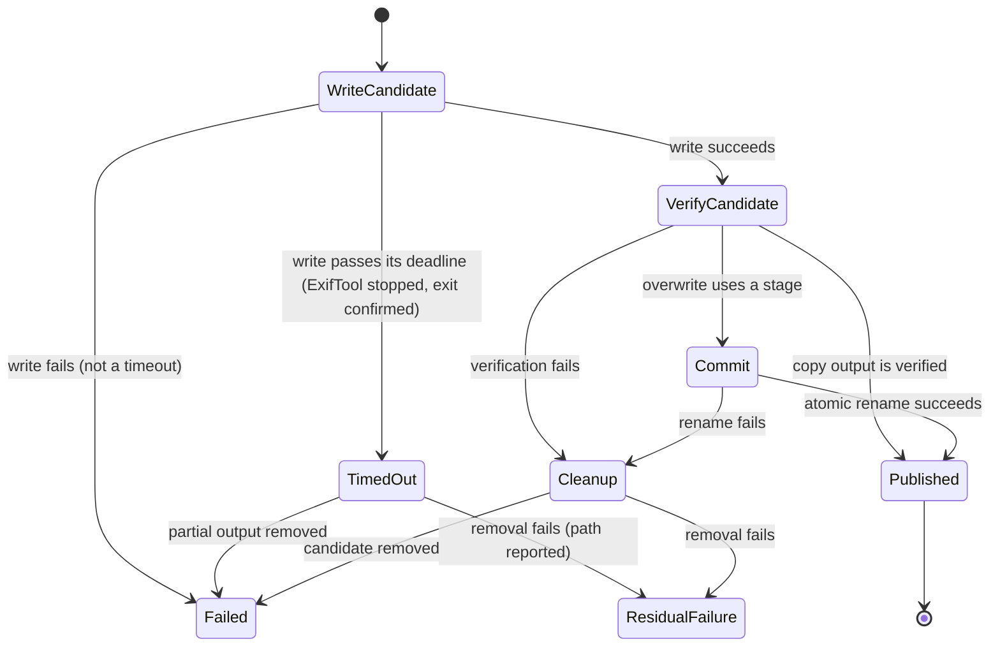

# File processing and output safety

The processing subsystem answers three separate questions:

1. What should ExifTool attempt?
2. Is the resulting file structurally readable?
3. What did the measured metadata actually do?

Keeping those questions separate prevents a successful process exit from becoming a
false product claim.

## Output transaction

Every ExifTool command has its own deadline, started when the command is dispatched: 30
seconds for reads, and 30 seconds plus the source size divided by 20 MB/s for writes (the
20 MB/s floor is an assumption, not a measured speed). `ExiftoolProcess` keeps one command in
flight at a time. When a deadline passes, it kills the ExifTool process tree, waits for the
exit to be confirmed, rejects only the timed-out command, then starts a fresh session and
dispatches the next queued command. `OutputTransaction` removes the partial candidate only
after that confirmed exit (`confirmedDeadTimeout`); every other write failure returns
`write-failed` without cleanup, because only the timeout case knows the writer is dead.

`StripMetadataCommand` owns flag construction. The order of `-all=` and
`-TagsFromFile` is intentional: ExifTool applies arguments left-to-right, so preserved
orientation or color-profile fields must be copied back after stripping.

`OutputTransaction` always asks the command to write a candidate. It then uses
`VerifyGeneratedOutputQuery` to reopen the file before returning a path or replacing an
original.

## Outcome classification

`cleanExifData()` removes ExifTool's structural `System`, `File`, `JFIF`, `ExifTool`, and `Composite`
groups before the renderer reasons about metadata. Otherwise even a metadata-free JPEG
looks non-empty and the no-write path can never be reached.

`summarizeMetadataChange()` compares before/after keys and returns counts for before,
after, removed, and still present. `classifyMetadataOutcome()` maps the measurement to:

- `cleaned` — at least one measured field disappeared;
- `already-clean` — no removable metadata was present and no write was needed;
- `unchanged` — work completed but removed no measured field;
- `refused` — policy declined an unsafe write, currently RAF;
- `failed` — a named processing stage failed.

These outcomes drive summaries. Do not replace them with `beforeCount - afterCount`: an
after-only structural tag can make that arithmetic lie.

## When changing this subsystem

- Add a fixture that proves both the intended removal and important preserved data.
- Assert the whole directory effect, including unexpected files.
- Exercise copy and overwrite paths separately.
- For guarded formats, prove the verifier’s failing direction.
- Keep batch continuation in a renderer test.
