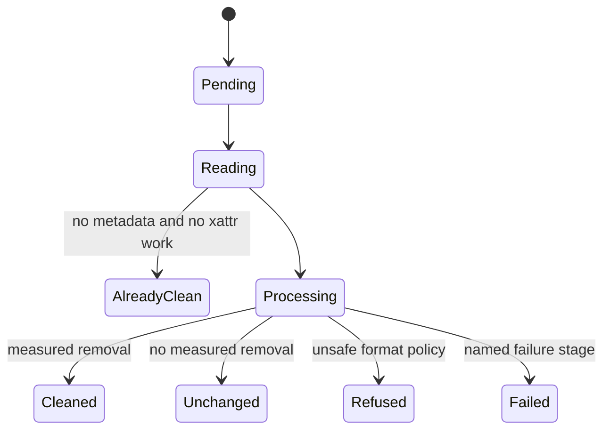

# Renderer state and results

The renderer is a projection of one batch. `AppContext` owns rows, folder discovery,
expansion, and terminal outcome facts; files on disk remain authoritative in main.

## Rows

A `FileEntry` carries source identity, grouping, before/after metadata, returned output
path and size, copy facts, outcome, and failure details. Reducer actions update one concern
at a time so a failed operation cannot accidentally retain a revealable success path.

## Table behavior

Headers provide stable sorting without a separate toolbar. Name uses natural comparison;
type is normalized; size always sorts by the source size; before/after sort numerically.
Sorting stays inside folder groups and keeps pending and error rows after terminal results.

Expanding a cleaned row shows removed fields immediately. Quiet headings group them by
ExifTool family. Fields still present live under one secondary disclosure. That ordering
matches the user’s first question: “what did you remove?”

## Summary truth

The cleaned count includes only `outcomeKind === "cleaned"`. Failures, refusals,
already-clean files, and unchanged files remain part of the total but not the cleaned
numerator. Removed-field totals come from key diffs stored on each row.

## Accessibility rules

- Headers expose sort state and remain keyboard operable.
- Rows and cells carry table semantics; nested reveal actions stop row activation.
- The settings modal is mounted only while open, traps focus, and hides background content.
- Filenames and paths use `bdi dir="auto"` so mixed-direction user text does not reorder UI.
- New interactions need keyboard tests and automated accessibility coverage.

